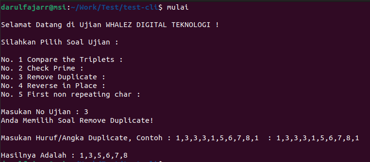

# algorithm-test-cli
## Cara Memulai Proyek `algorithm-test-cli`

Jalankan Perintah : 

    npm install

Seletelah berhasil jalan perintah

    mulai

maka hasilnya akan seperti contoh di atas
Anda dapat memilih berbagai jenis pilihan soal, pastikan Anda memiih soal yang tersedia di opsi pilihan.

### Contoh Pilihan Soal 1

### Contoh Pilihan Soal 2

### Contoh Pilihan Soal 3

### Contoh Pilihan Soal 4

### Contoh Pilihan Soal 5

